# Git-Work

### Trabajo hecho por Alberto Jimenez(user2) y Juan Carlos Toro(user1)
### Paso 1

#### Creamos un repositoria publico llamado Git-Work y añadimos readme.md y licencia mit.
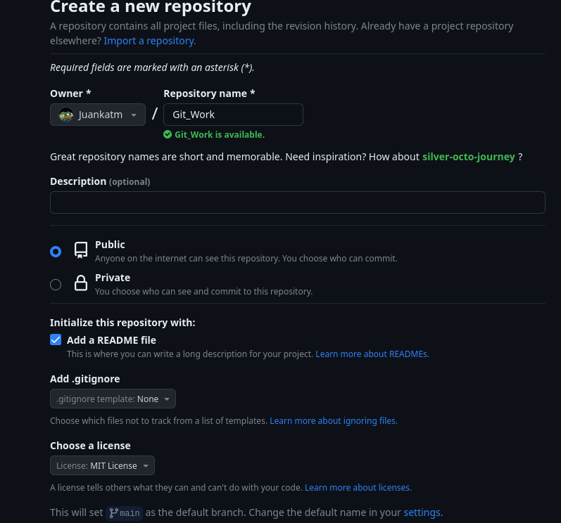

### Paso 2

#### Clonamos repositorio y añadimos los ficheros: index, bootstrap.css y cover.css.Luego subimos los cambios al remoto Origin.
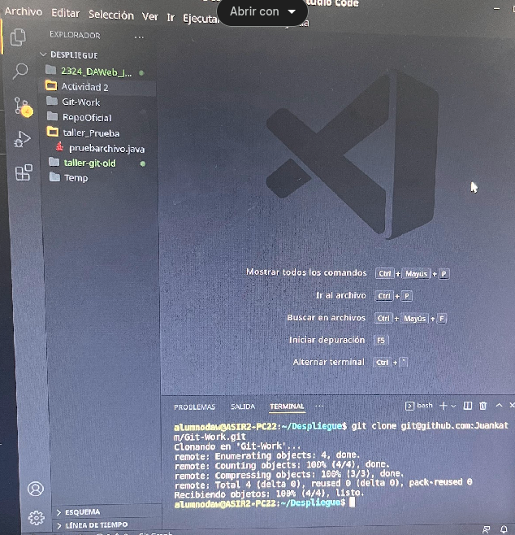
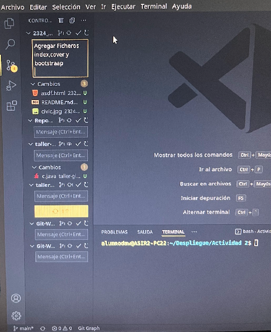

### Paso 3

#### Creamos un fork de gitwork.
.png)
.png)
.png)

### Paso 4

#### Clonamos el fork
.png)

### Paso 5

#### Creamos una rama llamada Custom-Text y modificamos el fichero index. Y subimos los cambios al remoto Origin.
.png)
.png)
.png)
.png)

### Paso 6

#### Enviamos un pullrequest al usuario1.
.png)
.png)

### Paso 7

#### Usuario1 prueba el pullrequest.
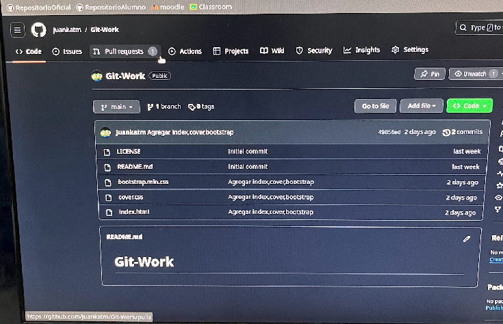
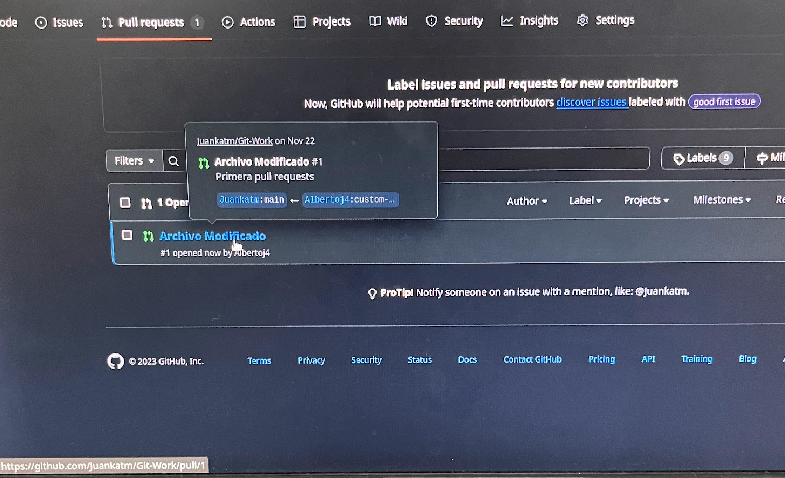

### Paso 8

#### Usuario1 y 2 conversan en el pullrequest.
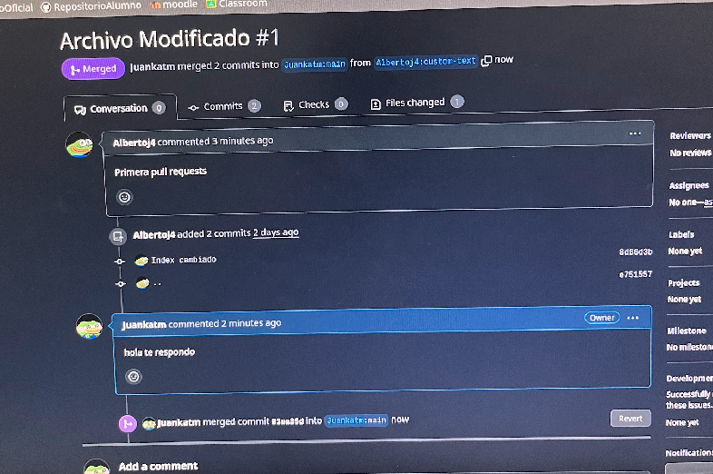
.png)

### Paso 9

#### Usuario1 aprobara el pullrequest.
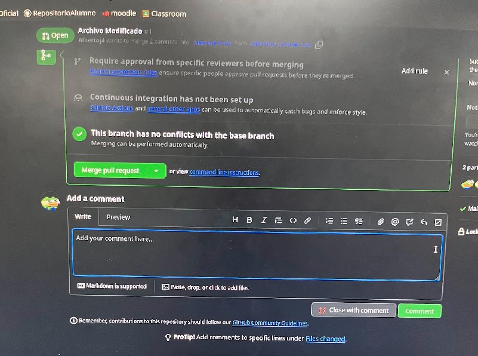
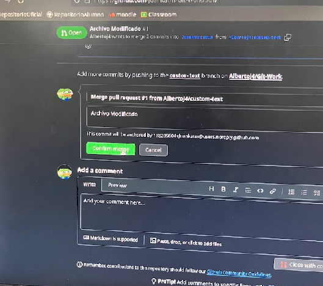

### Paso 10

#### Usuario1 actualiza rama principal en su copia local.
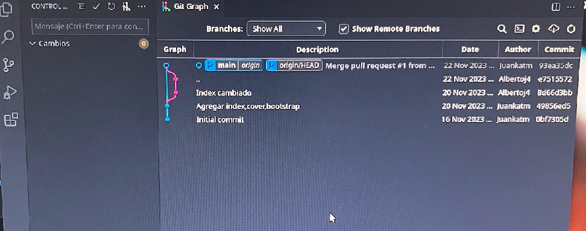

### Paso 11

#### Usuario2 incorpora cambios de usuario1 rama main. Ahora los cambios que envio el usuario2 en el pullrequest, se encuentran en la rama main de user1, y tambien en la del user2.
.png)
.png)

### Paso 12

#### User 2 elimina rama customtext
.png)
.png)

### Paso 13

#### En esta parte vemos que se ha borrado la rama customtext
.png)

### Paso 14

#### En user1 hace un release en gitHub con el mismo nombre de la etiqueta.
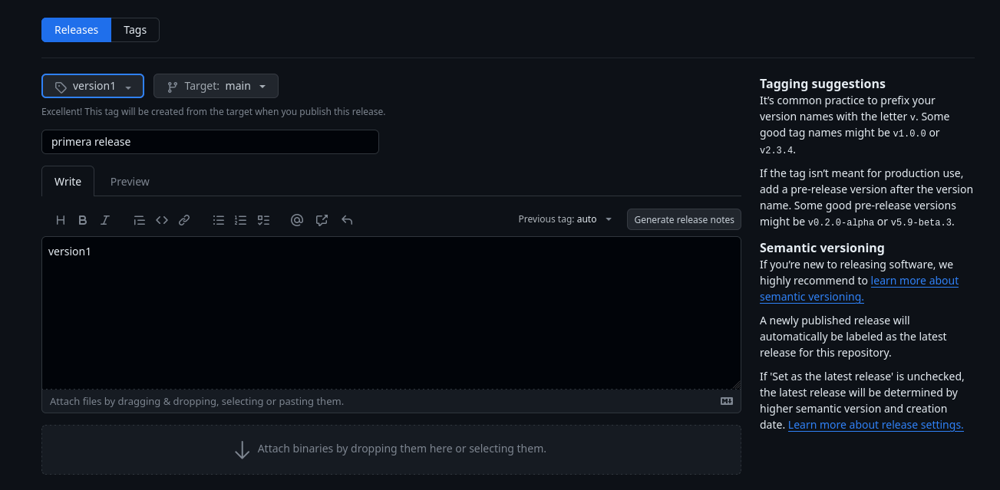
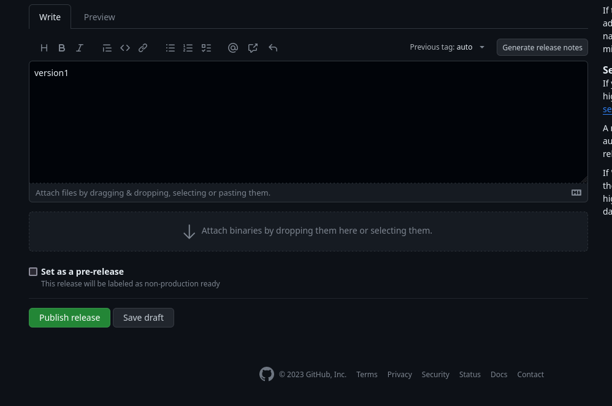
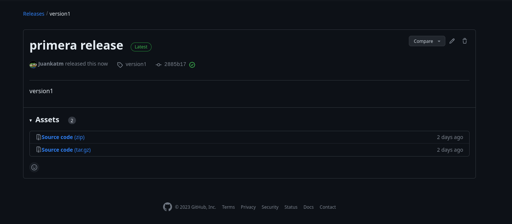